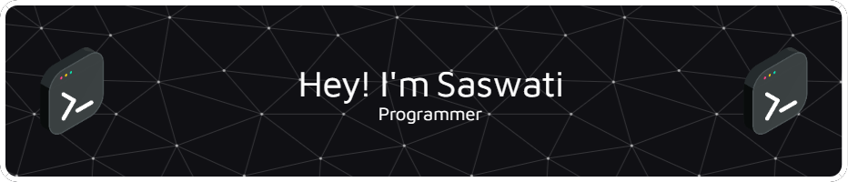

<!-- banner image to be updated -->

<!-- profile views -->

  

<!-- social links -->
<h3 align="center">🔗 Connect with me 🌏</h3>

    &nbsp;&nbsp;
    &nbsp;&nbsp;
    &nbsp;&nbsp;

<!-- github trophies -->
<h3 align="center">🏆 GitHub Trophies 🥇</h3>

  

 

<!-- github stats -->
<h3 align="center">📈 GitHub Stats 📊</h3>

     <!-- to be made responsive -->
    
      <!-- to be made responsive -->
    

    
    &nbsp;&nbsp;
    

 

<!-- Skills -->
<h1 align=center>

:books: Skills :desktop_computer:
</h1>

<h1>Platform:&nbsp;&nbsp; <!-- Platform -->
    &nbsp;&nbsp;
    &nbsp;&nbsp;
    &nbsp;&nbsp;
</h1>

<h1>Language & Script:&nbsp;&nbsp; <!-- Language & Script -->
    &nbsp;&nbsp;
    &nbsp;&nbsp;
    &nbsp;&nbsp;
    &nbsp;&nbsp;
</h1>

<h1>Frontend:&nbsp;&nbsp; <!-- Frontend -->
    &nbsp;&nbsp;
</h1>

<h1>DevOps:&nbsp;&nbsp; <!-- DevOps -->
    &nbsp;&nbsp;
    &nbsp;&nbsp;
</h1>

<h1>IoT:&nbsp;&nbsp; <!-- IoT -->
    &nbsp;&nbsp;
</h1>
